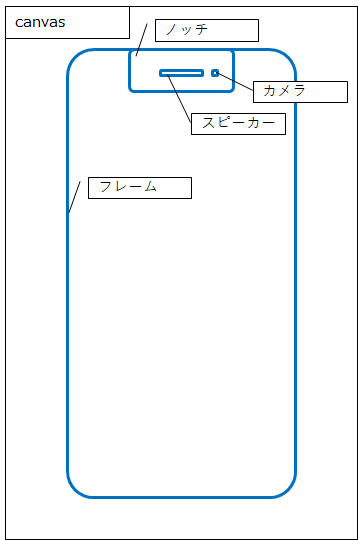
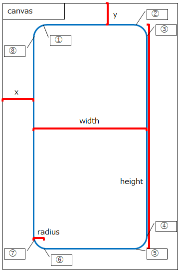

# iPhone12のスクショをノッチ付きで保存する

以下のURLからどうぞ

https://make-iphone-screenshot.netlify.app/

ファイル選択後、表示される画像を右クリックから保存してください。

## 設計

|No|x位置|y位置|
|---|---|---|
|①|x + r|y|
|②|x + w - r|y|
|③|x + w|y + r|
|④|x + w|y + h - r|
|⑤|x + w - r|y + h|
|⑥|x + r|y + h|
|⑦|x|y + h - r|
|⑧|x|y + r|

